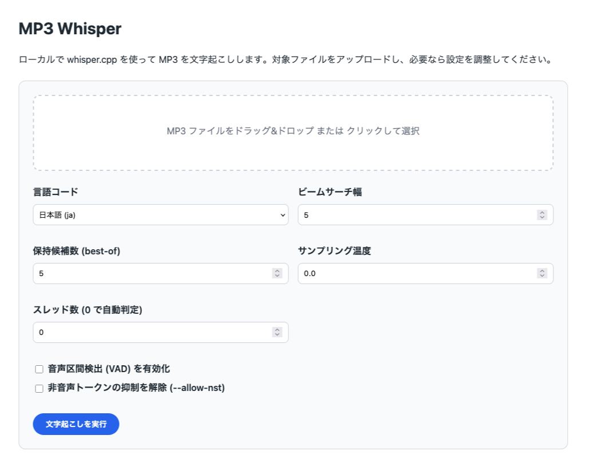

## プロジェクト概要

Whisper.cpp MP3 文字起こしツールは、ローカルで whisper.cpp を利用して MP3 → テキスト変換を行うための CLI / Web GUI ラッパーです。モデルのダウンロードやバイナリビルドをスクリプト化し、Mac / Linux 環境ですぐに利用できます。

---

## クイックスタート

1. セットアップ手順を参照: [`docs/1_setup.md`](docs/1_setup.md)
2. Web GUI を起動:

   ```bash
   ./scripts/run_web.sh
   ```

   - 初回実行時に `.venv/` 仮想環境を自動生成し、依存インストール・whisper-cli ビルド・モデル取得をまとめて実行します。
   - サーバー起動後は既定ブラウザが自動的に `http://127.0.0.1:5000/` を開きます。不要な場合は `WHISPER_GUI_AUTO_OPEN=0` を設定してください。

3. ブラウザにアクセスし、MP3 ファイルをアップロードすると文字起こし結果が表示されます。

---

## ドキュメント

- [`docs/1_setup.md`](docs/1_setup.md) … 必要環境、初期セットアップ、CLI 動作確認
- [`docs/2_how-to-use.md`](docs/2_how-to-use.md) … Web GUI の使い方、環境変数、トラブルシューティング

---

## ライセンス / 注意事項

- whisper.cpp のライセンスは `vendor/whisper.cpp/LICENSE` を参照してください。
- 大容量モデルや音声ファイルを扱う場合は、ストレージ残量とアップロード上限 (`WHISPER_GUI_MAX_UPLOAD`) を事前に確認してください。
